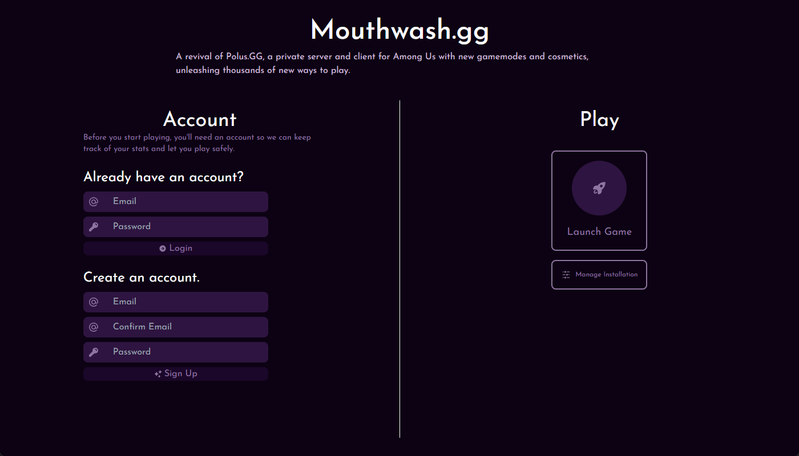
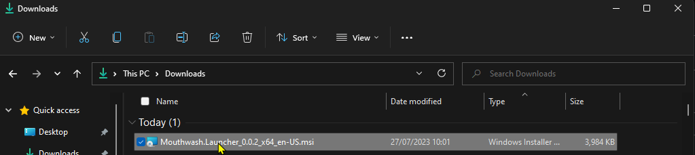
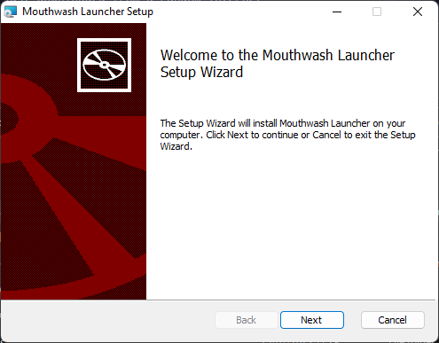
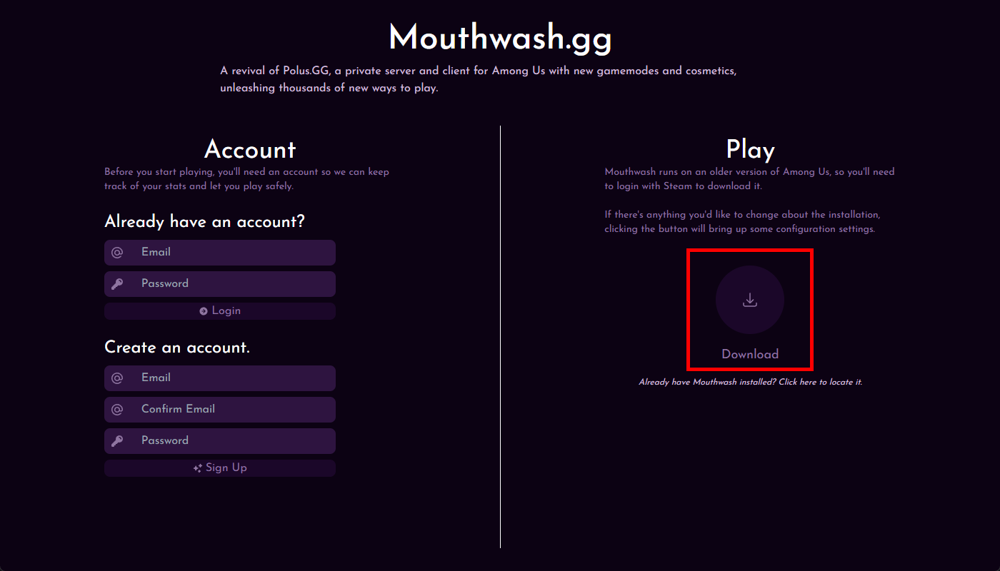
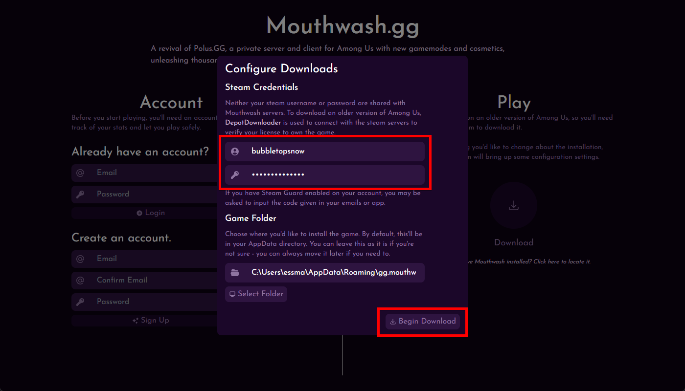
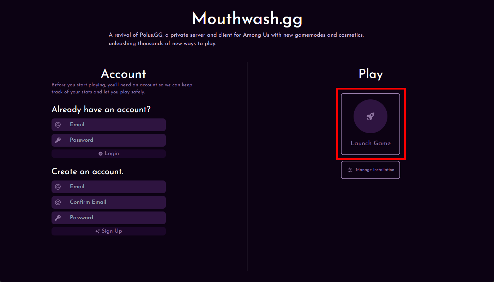

# Mouthwash

## For the players
### What is Mouthwash? 🪥
Mouthwash is a revival of the original Polus.gg client with a brand new server.

### Where can I install it?
Mouthwash comes with its very own launcher: 

The launcher can be downloaded by using the most recent release from the [Releases page](https://github.com/edqx/MouthwashPublic/releases) in this GitHub repository. If you think you know what you're doing, you can go ahead and download the launcher and you should be able to quickly install and get started with playing.

### Instructions for Installation

#### Step 1.
Install the most recent release from the [Releases page](https://github.com/edqx/MouthwashPublic/releases) in this GitHub repository. If you click the "Assets" section, it should reveal some downloads - you're looking for the one that ends in `.msi`.

Your Anti-Virus may have lots of issues installing Mouthwash. If you don't trust the download - unfortunately there is no alternative to download Mouthwash at this time so you'll have to wait for Mouthwash to be verified and signed as an official application, which may be never.

#### Step 2.
Run the `.msi` installer and click "Next" through each screen.

Your Anti-Virus will hate this step too, since you're executing an unverified application that you just downloaded from a random internet location.

After installing, Mouthwash will be available as an application on your computer, and may have even opened itself at the end of the setup.

#### Step 3.
With the Mouthwash launcher open, click "Download" to start installing the client mod.

You'll be asked in to login with steam ([Why?](#Why-do-I-have-to-login-with-steam)), as well as choose a folder on your computer to install the game to. You can leave the folder as it is.

During the installation, you might be asked for a Steam Guard authentication code if you have it enabled. You'll either be able to press a button on your Steam app on your phone to authenticate the log-in, or you'll get given a code by e-mail or in the app which you can input into the Mouthwash launcher.

#### Step 4.
While your game is installing, use the section on the left (under "Create an account.") to create a new account to start playing with. After verifying your email address by clicking the link sent to your email inbox (make sure you check your spam folder), you should be able to log in to your account.

The game won't let you launch the game until you either login to an existing Mouthwash account or create a new one.

#### Step 5.
Click "Launch Game"!

